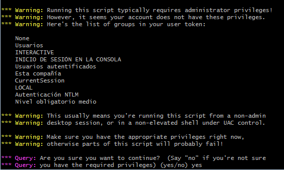
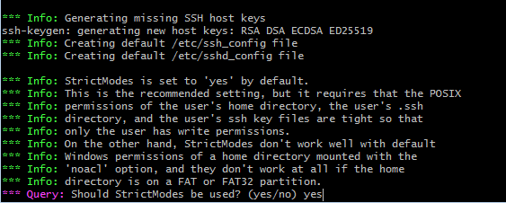
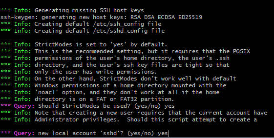
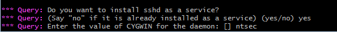
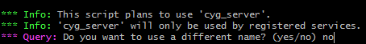
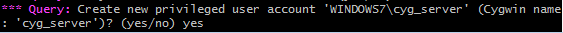
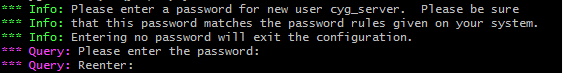
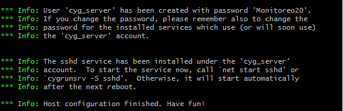

Configurar Openssh
======

- Ejecutamos la consola de Cygwin como administrador y lanzamos el siguiente comando::

	$ ssh-host-config

- En las siguientes imágenes observaremos el paso a paso de la configuración:

- Luego debemos proceder a iniciar el servicio en windows:

- y si consultamos el puerto 22 ya debe estar en escucha:

.. image:: ../imagenes/configuracion/Selección_093.png
