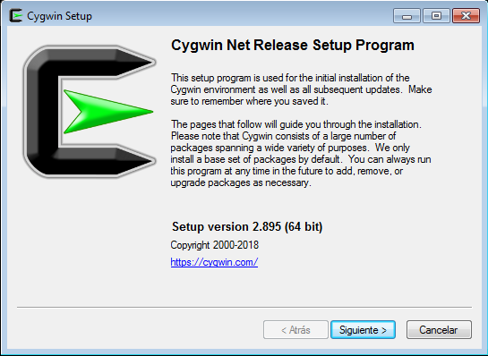
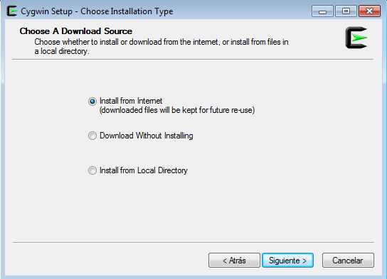
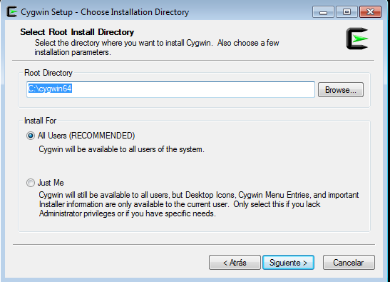
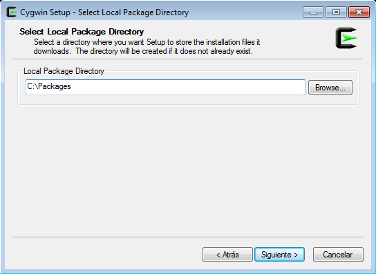
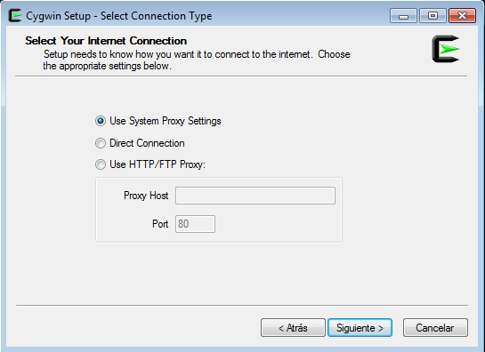
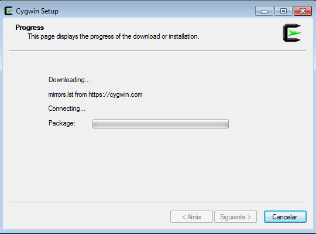
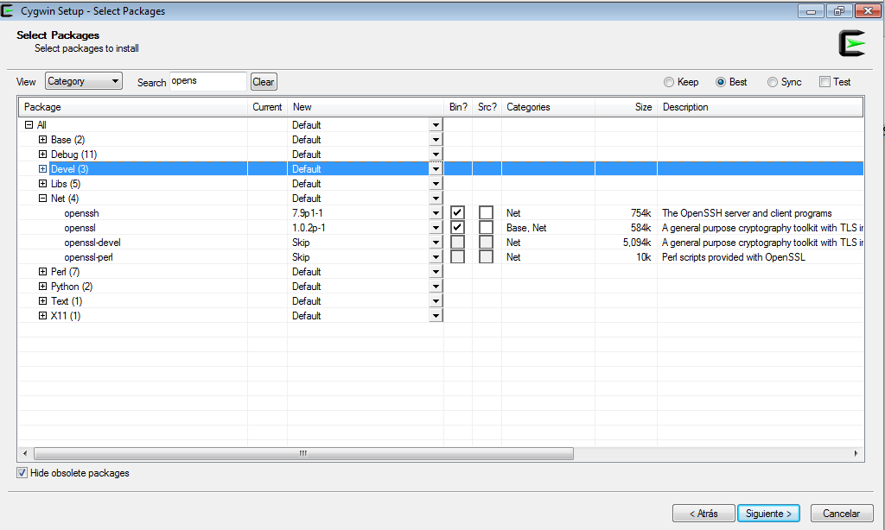
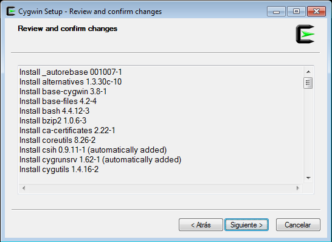
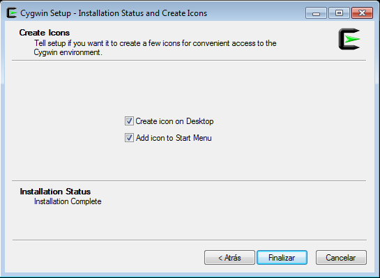
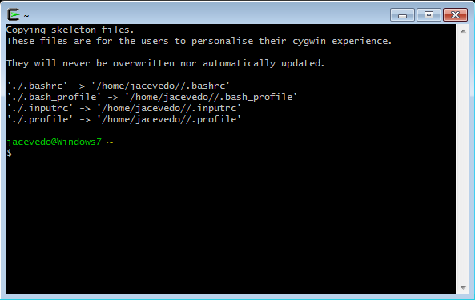

Instalar Cygwin para OpenSSH
=========

- Descargamos Cygwin para windows y lo ejecutamos:

- Seleccionamos la instalación vía internet:

- Indicamos el directorio de Instalación:

- Indicamos el directorio a donde se guardaran los paquetes de manera local:

- Seleccionamos la opción "User system Proxy Settings":

- Se procede a realizar la descarga de internet:

- Seleccionamos el mirror:

.. image:: ../imagenes/instalacion/Selección_077.png

- Luego en la selección de paquetes, en la busqueda colocamos "opens", y posteriormente seleccionamos openssh y openssl en sus últimas versiones:

- Nos muestra todos los paquetes a instalar y le damos siguiente:

- Se muestra la instalación en progreso:

.. image:: ../imagenes/instalacion/Selección_080.png

- Nos muestra un mensaje de instalación completa y le damos a finalizar:

- Ya podemos ingresar a Cygwin:

